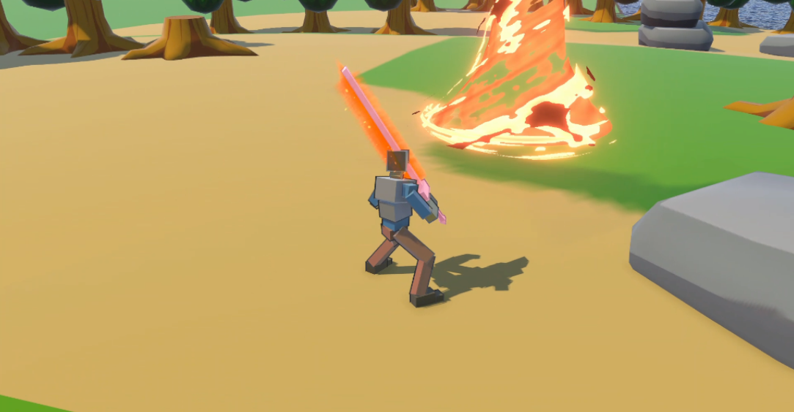
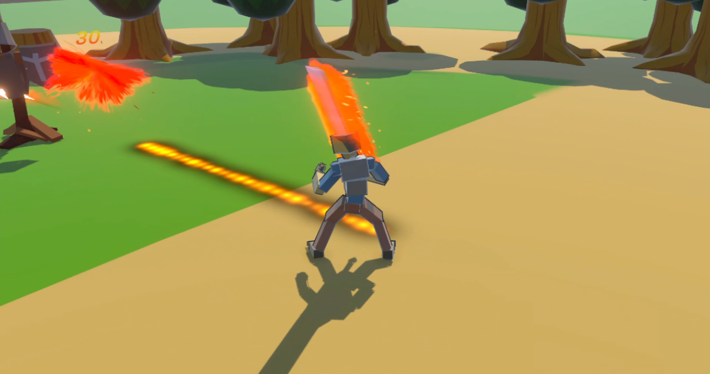
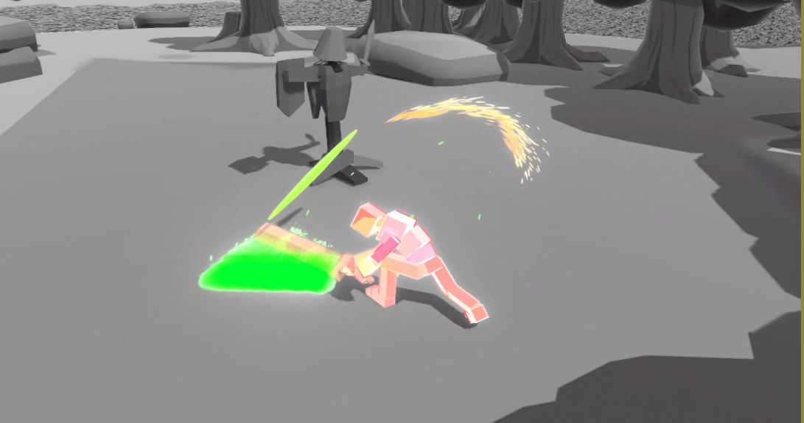
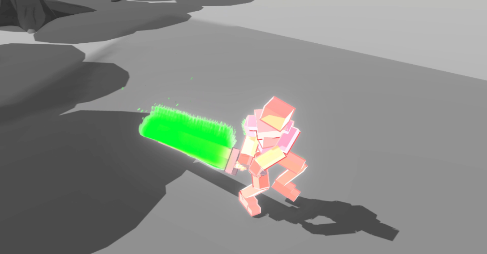

# Shader Game

Développement d'un jeu Unity de type RPG combat sans gameplay ayant pour but d'apprendre à utiliser les shaders, particules...  
Développement des compétences en shader.  
Equipe de 3 développeurs.

## Description

Ce jeu a été développé en une semaine avec 2 autres étudiants, il s'agit d'un RPG de combat sans gameplay visant à apprende le plus de choses possibles sur les shaders.

## Technologies utilisées

- Unity
- Shader Graph
- VFX Graph
- Git

## Captures d’écran

## Auteurs

Benjamin Benon [LinkedIn](https://www.linkedin.com/in/benjamin-benon-78b495194/)  
Gianni Charles-Nicolaï  
Grégoire Portevin
